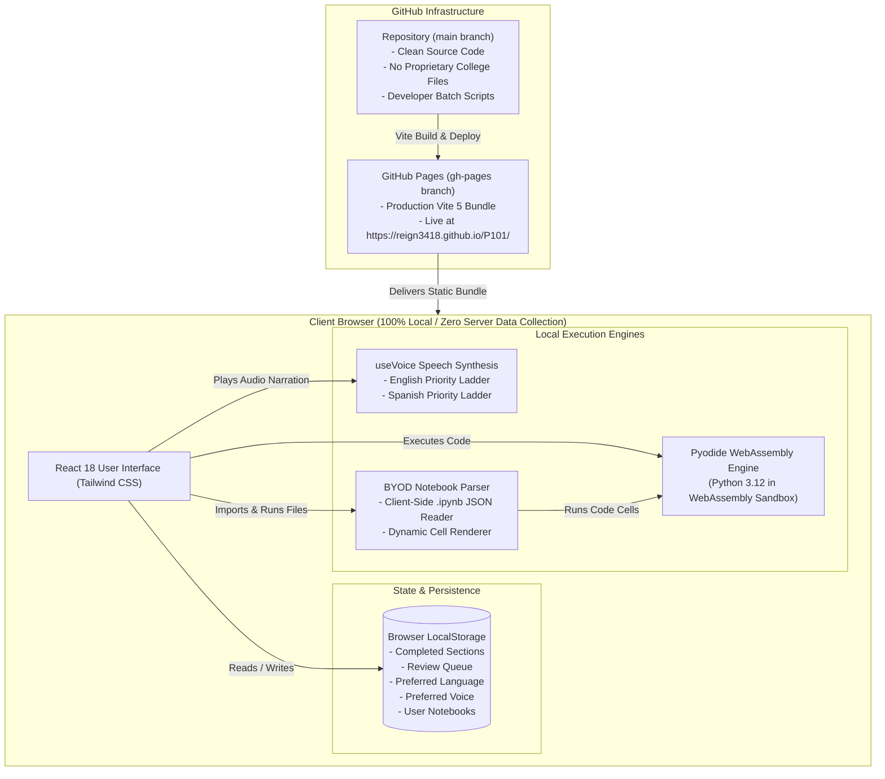

# P101: System Architecture, Design Decisions & Project Evolution

> **Interactive Python Deliberate Practice Portal, BYOD Notebook Engine & Deliberate Practice Gym**  
> Aligned with **Prof. Jade Cao** (Central Carolina Community College) & **Tony Gaddis** (*Starting Out with Python*, 6th Edition).

---

## 1. Executive Summary & Pedagogical Mission

**P101** was engineered as an advanced learning companion and deliberate practice gym for students learning Python. It solves three fundamental challenges observed in modern computer science education:

1. **The Textbook vs. Lecture Disconnect**: Standard syllabi often assign classic textbooks (such as Tony Gaddis's *Starting Out with Python*), while contemporary instructors (such as Prof. Jade Cao at CCCC) follow project-first curricula (introducing Lists, Dictionaries, and Decision Logic early). P101 synchronizes both frameworks into a single cohesive learning path.
2. **Passive Reading vs. Active Muscle Memory**: Conventional reading fosters an illusion of competence. P101 embeds **infinite randomized coding workouts** (both in the browser and in a standalone terminal gym) where variables, numbers, and test criteria dynamically shift on every attempt.
3. **Transition from Structured/Military Background to Civilian Tech**: Built with the perspective of a 24-year retired Senior NCO transitioning to civilian software engineering, the curriculum translates discipline, attention to detail, and operational readiness into civilian software engineering paradigms: **Business Requirements**, **Acceptance Criteria**, **Root-Cause Diagnostics**, and **Code Reviews**.

---

## 2. High-Level Architecture Diagram



---

## 3. Technology Stack & Component Hierarchy

### Core Technologies
- **UI Framework**: React 18.3 (Functional components, custom hooks, reactive state)
- **Build Tooling**: Vite 5.4 (Hot Module Replacement, sub-second production builds)
- **Styling**: Tailwind CSS 3.4 (Slate/Dark Mode responsive layout, custom scrollbars)
- **Icons**: Lucide React 0.460
- **In-Browser Python Engine**: Pyodide 0.26.2 (CPython compiled to WebAssembly)
- **Speech Synthesis**: Web Speech API (`SpeechSynthesis` & `SpeechSynthesisUtterance`)
- **Hosting / CDN**: GitHub Pages (Static hosting directly from `gh-pages` branch)

### Component Tree
```
src/
├── main.jsx                   # React root entry point
├── App.jsx                    # Primary application controller & view switcher
├── index.css                  # Global styles, fonts, and dark mode base
├── data/
│   ├── chaptersData.js        # 10 bilingual chapters, 18 sections, quizzes, and reps
│   └── translations.js        # English & Spanish UI dictionary
├── hooks/
│   ├── usePyodide.js          # Pyodide WebAssembly lifecycle and stdout capture
│   └── useVoice.js            # Multilingual voice engine with priority ladders
└── components/
    ├── Header.jsx             # Top navigation, language toggle, voice picker, citations
    ├── Sidebar.jsx            # Course progress bar, review queue, module list, BYOD launcher
    ├── WhyBox.jsx             # "The Why Under the Hood" conceptual breakdown with audio
    ├── ConceptBox.jsx         # Syntax rules, runnable reference code, and console output
    ├── CodingRepLab.jsx       # In-browser randomized coding workout with Pyodide
    ├── TrapBox.jsx            # Common pitfalls and beginner bugs
    ├── QuizBox.jsx            # Checkpoint quiz with "Take Me to Review" auto-navigation
    ├── CitationModal.jsx      # Academic citations and 1-click homework comment copy
    └── NotebookViewer.jsx     # Bring Your Own Notebook (BYOD) parser and runner
```

---

## 4. Subsystem Deep-Dives

### 4.1 In-Browser WebAssembly Python Runner (`usePyodide.js`)
Rather than relying on an expensive or insecure remote server backend to execute student Python code, P101 loads **Pyodide** via CDN.
- **Client-Side Sandbox**: Python code runs directly in the browser’s WebAssembly memory space.
- **`stdout` Redirection**: Wraps user code in `io.StringIO()` to capture `print()` output without polluting the browser console.
- **Variable Inspection**: Directly reads internal Python global variables (`pyodide.globals.get()`) to evaluate whether student solutions satisfy acceptance criteria.
- **Diagnostic Parser**: Intercepts Python exceptions (`SyntaxError`, `IndentationError`, `TypeError`, `NameError`, `ZeroDivisionError`) and translates them into plain-English root-cause explanations.

### 4.2 Multilingual Speech Synthesis Engine (`useVoice.js`)
To provide multi-sensory learning, the application reads the "Why Under the Hood" explanations aloud using natural browser text-to-speech.
- **Language Detection**: Automatically configures the voice engine according to the active language (`en` or `es`).
- **Voice Priority Ladders**:
  - **English Ladder**:
    1. `Google US English` (Chrome cloud voice)
    2. `Microsoft Aria / Jenny Online (Natural)` (Edge near-human neural voice)
    3. `Microsoft David / Zira Desktop` (Windows clean built-in voice)
    4. Fallback to any `en-US` voice
  - **Spanish Ladder**:
    1. `Google español` (Chrome natural cloud voice)
    2. `Microsoft Sabina / Dalia / Jorge Online (Natural)` (Edge neural voice)
    3. `Microsoft Helena / Laura / Pablo Desktop` (Windows built-in Spanish voice)
    4. Fallback to any `es-ES`, `es-MX`, or `es-US` voice
- **Dynamic Voice Picker**: A header dropdown filters installed voices by the active language and displays quality badges (`Google`, `Neural ★`, `Microsoft`).
- **Cadence Optimization**: Audio rate is tuned to `0.92–0.95` with pitch at `1.02` for instructional clarity.

### 4.3 Bring Your Own Data (BYOD) Notebook Lab (`NotebookViewer.jsx`)
To ensure complete compliance with university intellectual property policies, P101 uses a **Bring Your Own Data (BYOD)** client-side architecture:
- **Zero Proprietary Files on GitHub**: The public repository contains **no instructor lecture files or exam keys**.
- **Local Parsing**: Students download `.ipynb` files from their college LMS (Blackboard, Moodle, or Canvas) and drag-and-drop them into the browser.
- **Dynamic Cell Execution**: Parses Markdown cells into clean styled lecture notes and wraps code cells in an interactive editor with line numbers, 1-click copying, and a **"▶ Run Cell"** Pyodide trigger.
- **Offline Persistence**: Imported notebooks are stored locally in the student's browser `localStorage` (`p101_user_notebooks`).

### 4.4 Bilingual Internationalization (i18n) System
- **Centralized Dictionary (`translations.js`)**: Provides comprehensive English and Spanish strings for all UI buttons, labels, tooltips, and modal dialogues.
- **Curriculum Localization (`chaptersData.js`)**: All 10 chapters and 18 sections include complete Spanish translations for titles, descriptions, "Why" breakdowns, pitfalls, and quizzes.
- **Dynamic Getter (`getLocalizedChapters(lang)`)**: Returns the localized curriculum tree seamlessly based on the selected language, preserving code logic and test cases.
- **Zero-Reload Toggle**: Header switch `[ 🇺🇸 EN | 🇪🇸 ES ]` updates the entire DOM and speech engine instantaneously.

---

## 5. Compliance, Copyright & Academic Integrity Framework

An extensive compliance audit was conducted to guarantee that P101 upholds the highest legal and academic standards:

| Compliance Area | Implementation Standard | Status |
| :--- | :--- | :--- |
| **Plagiarism Prevention** | Explicit attribution cards for **Prof. Jade Cao (CCCC)** as course instructor and **Tony Gaddis (Pearson)** as companion textbook author. 1-click citation generators provided for student homework comments. | 🟢 **100% Compliant** |
| **Copyright Law (17 U.S.C. § 107)** | The learning portal, "Why" breakdowns, diagnostics, and workouts are original transformative educational software protected under Fair Use. | 🟢 **100% Compliant** |
| **Distribution of Course Materials** | **BYOD Architecture**: Raw college `.ipynb` files are strictly excluded from git tracking (`.gitignore`) and remain exclusively on the student's local drive. Zero college materials are hosted on public GitHub. | 🟢 **Zero Liability** |
| **Open Source Licensing** | React (MIT), Vite (MIT), Tailwind CSS (MIT), Lucide (ISC), Pyodide (Mozilla Public License 2.0). All license boundaries strictly respected. | 🟢 **100% Compliant** |

---

## 6. Terminal Deliberate Practice Gym (`python_reps.py`)

For focused coding workouts in the terminal or Windows Command Prompt, the project includes a standalone workout engine:
- **Launch Command**: `python python_reps.py` (or double-click `START_REPS_GYM.bat`).
- **Curriculum Alignment**: Mirrors Prof. Jade Cao’s classroom workshops:
  - *Module 1*: Student Name Sanitizer (`.strip()`, `.title()`)
  - *Module 2.1*: Coffee Order Queue Management (`.append()`, `.insert(0, ...)`, `.pop(0)`)
  - *Module 3.1*: Smart Café Order & Pricing Assistant (`if-elif-else` guard clauses)
  - *Module 3.2*: Campus Course Catalog Lookup (`dict.get()`, nested structures)
  - *Module 4.2*: Smart Grocery Cart Totalizer & Budget Audit (accumulators & bounds)
  - *Module 5.2*: Player Profile Formatter (default arguments & `None` handling)
- **Automated Test Battery**: Compiles user code in real time, runs 4–5 randomized test cases including boundary and edge cases, and logs streaks.

---

## 7. Git & Deployment Strategy

### Branch Architecture
- **`main` Branch**: Contains clean source code, React components, hooks, translation dictionaries, batch launchers, and documentation. No build artifacts or college files are tracked.
- **`gh-pages` Branch**: Dedicated deployment branch hosting the compiled Vite production bundle (`dist/`). GitHub Pages serves directly from this root commit.

### One-Click Desktop Batch Launchers
Located in the project root for seamless operations without command-line friction:
- [`START_REACT_DEV.bat`](file:///E:/PythonClass/START_REACT_DEV.bat) — Launches local Vite development server (`http://localhost:5173/P101/`).
- [`DEPLOY_PAGES.bat`](file:///E:/PythonClass/DEPLOY_PAGES.bat) — Builds the production bundle and force-pushes to `origin/gh-pages`.
- [`START_REPS_GYM.bat`](file:///E:/PythonClass/START_REPS_GYM.bat) — Launches the interactive terminal gym.
- [`PUSH_TO_GITHUB.bat`](file:///E:/PythonClass/PUSH_TO_GITHUB.bat) — Syncs source code commits to `origin/main`.

---

## 8. Project Evolution & Chronological Changelog

```
[Phase 1: Foundation]
  • Initial Python learning portal created based on Gaddis 6th Edition.
  • Terminal deliberate practice gym (python_reps.py) designed with automated grading.

[Phase 2: Modern Web Architecture]
  • Upgraded to React 18 + Vite 5 + Tailwind CSS.
  • Integrated Pyodide WebAssembly engine for client-side Python execution.
  • Deployed production build to GitHub Pages (https://reign3418.github.io/P101/).

[Phase 3: Curriculum Synchronization]
  • Incorporated Prof. Jade Cao's (CCCC) 9 lecture modules (Variables, Lists, Dicts, While Loops, Functions).
  • Re-sequenced learning path to match live lectures while retaining Gaddis advanced capstones.
  • Added formal academic citation cards and 1-click homework comment copy tools.

[Phase 4: Compliance Audit & BYOD Audible]
  • Conducted azimuth check on copyright and academic integrity standards.
  • Untracked raw college .ipynb files from git; updated .gitignore.
  • Built Bring Your Own Data (BYOD) in-browser notebook parser with Pyodide execution.

[Phase 5: Audio & Voice Quality Upgrade]
  • Replaced generic browser speech with dedicated useVoice hook.
  • Implemented priority ladder for Google Cloud and Microsoft Neural voices.
  • Added interactive voice picker dropdown in header.

[Phase 6: Full-Site Internationalization (i18n)]
  • Built centralized English and Spanish translation dictionary (translations.js).
  • Translated all 10 modules, 18 sections, "Why" notes, and quizzes into natural Spanish.
  • Integrated Spanish neural voice synthesis with automatic language-matching.
  • Added header language toggle [ 🇺🇸 EN | 🇪🇸 ES ] with local storage persistence.
```

---

## 9. Maintainers & Attribution

- **Architect & Developer**: Reign3418
- **Primary Course Instructor**: Prof. Jade Cao, Central Carolina Community College (CCCC)
- **Textbook Companion**: Tony Gaddis, *Starting Out with Python* (6th Edition), Pearson
- **Live Application**: [https://reign3418.github.io/P101/](https://reign3418.github.io/P101/)
- **Repository**: [https://github.com/Reign3418/P101](https://github.com/Reign3418/P101)
